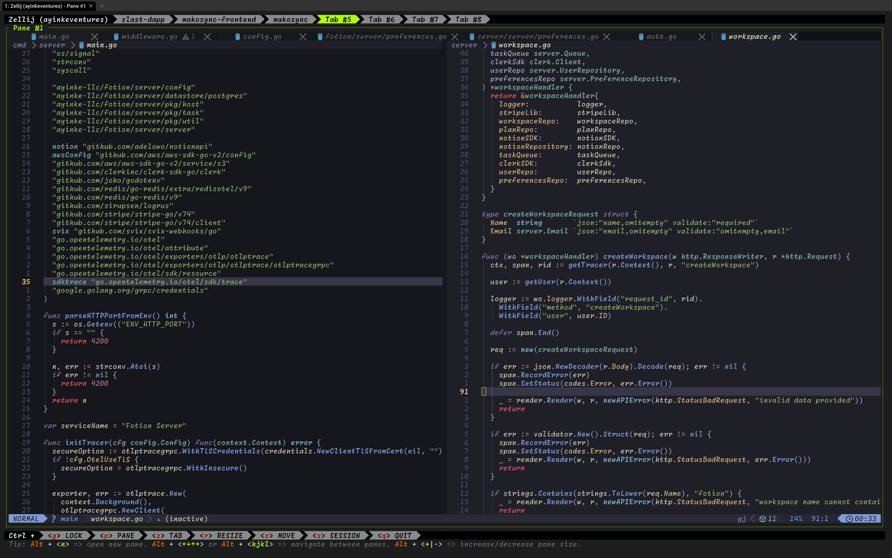
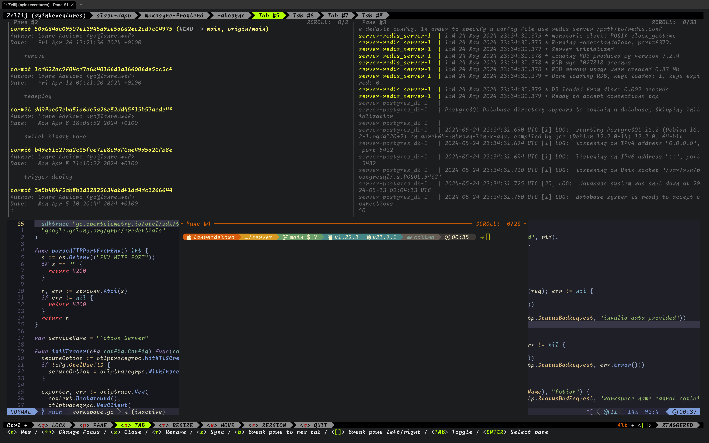

# Dotfiles ( always a WIP )

Currently using Zellij and Wezterm

I am making critical updates to my dotfiles. Why?

- To fix organization. I started using Neovim in 2017 and i ended up with a
  ridiculously large `init.vim` because i was just learning on the go
  and kept adding stuff to the same file. It became hard to read/find simple configs
- Moving onto better tech. Vimscript is ugly and annoying to write. I am
  switching fully to Lua

> You can take a look at my dotfiles I used from 2017-2023 at this commit [d2a27a69a700ecafdbee07043dd5ee0c01c06476](https://github.com/adelowo/dotfiles/commit/d2a27a69a700ecafdbee07043dd5ee0c01c06476)

## Current look

### Floating and stacked panes

> Prefer this so much to Tmux panes

